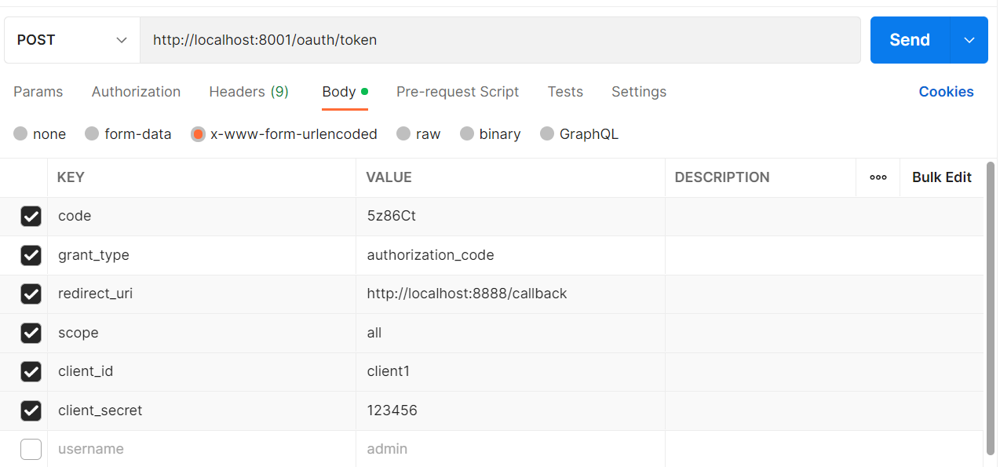
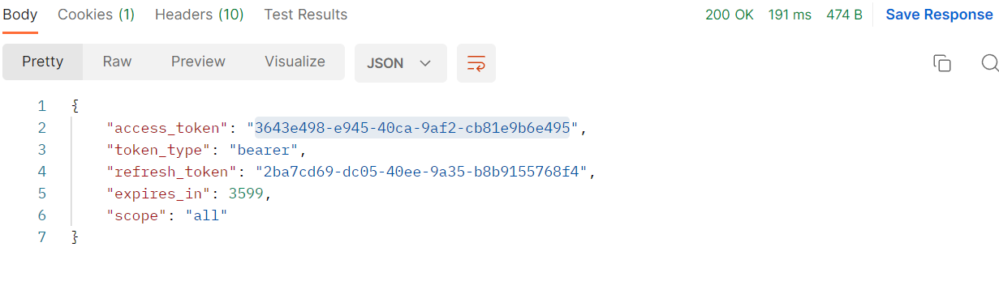

## 授权码模式获取token

### 获取授权码code
```markdown
http://localhost:9902/oauth/authorize?client_id=client1&redirect_uri=http://localhost:8888/callback&response_type=code&scope=all
```
> 登录用户名: admin
> 
> 登录密码：123456

### 获取token
```markdown
http://localhost:8001/oauth/token
```


### 得到返回结果
