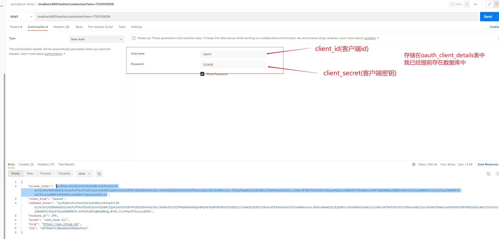

# 自定义授权模式

## 自定义端点

添加手机和邮箱登录授权模式，首先采取的是自定义端点的方式，也就是添加新的端点来接收手机和邮箱验证码的请求。
使用自定义`controller`实现。

### URL 设计

在那之前我们要先进行 url 的设计。

对于我们自己定义 controller 来完成的端点

>手机登录： /custom/sms

>邮箱登录： /custom/email


### 自定义 controller

顾名思义，我们需要自己创建 controller 来完成授权，我们先完成不使用验证码的，也就是不加入过滤器中的。创建如下 controller ：
```java
/**
 * 自定义 controller 授权端点
 * 
 */
@Slf4j
@RestController
@RequiredArgsConstructor
@RequestMapping("/custom")
public class CustomToken {

    @PostMapping("/{type}")
    public HttpEntity<?> auth(HttpServletRequest request, @PathVariable String type) {
        return ResponseEntity.ok(type);
    }

}
```

记得在`security`的配置文件中放行`/custom/**`。

该接口请求成功后，应该直接给他下发`token`。

下发`token`的前提就是创建`token`，这个`token`怎么创建的呢？
我们来看源码，他的`token`创建的核心类是`org.springframework.security.oauth2.provider.token.DefaultTokenServices`在这里你可以找到一个`createAccessToken`方法。
但是这个方法需要我们传递一个类型为`OAuth2Authentication`的参数；
而构建`OAuth2Authentication`我们需要`OAuth2Request`和`Authentication`这两个参数；
而构建`OAuth2Request`需要使用`TokenRequest#createOAuth2Request`进行构建，
构建`Authentication`需要我们去用它的子类`UsernamePasswordAuthenticationToken`来构建；
而构建`TokenRequest`需要客户端信息，构建`UsernamePasswordAuthenticationToken`需要`UserDetails`；而构建`UserDetails`需要`UserDetailsService`，然后注入即可。

这个过程有点复杂，我们用一张图来解释：


所以步骤应该如下：

1. 从请求中获取客户端信息，然后通过 ClientDetailsService 构建为 ClientDetails
2. 通过上一步的 ClientDetails 构建令牌请求 TokenRequest
3. 通过第一、二步的 ClientDetails 和 TokenRequest 构建 oauth2 令牌请求 OAuth2Request
4. 通过 UserDetailsService 获取当前手机/邮箱号对应用户信息 UserDetails
5. 通过 UserDetails 构建 Authentication 的实现类 UsernamePasswordAuthenticationToken
6. 通过第三、五步的 OAuth2Request 和 Authentication 构建 oauth2 身份验证授权 OAuth2Authentication
7. 通过上一步的 OAuth2Authentication 和 AuthorizationServerTokenServices 创建 token
   
这些从源码就可以看得出来，只是有些地方层次比较深，需要仔细一点去看看他的具体实现类。由于这个系列以实践为主，所以不会带大家一步一步去找和阅读源码。

现在我们开始来写代码，修改我们的类最后如下：

```java
import com.security.service.UserService;

@Slf4j
@RestController
@RequiredArgsConstructor
@RequestMapping("/custom")
public class CustomToken {

    private final @NonNull UserService userService;
    private final @NonNull ClientDetailsService clientDetailsService;
    private final @NonNull PasswordEncoder passwordEncoder;
    private final @NonNull AuthorizationServerTokenServices authorizationServerTokenServices;

    @PostMapping("/{type}")
    public HttpEntity<?> auth(HttpServletRequest request, @PathVariable String type) {
        // 判断是否是我们自定义的授权类型
        if (!type.equalsIgnoreCase("sms") && !type.equalsIgnoreCase("email")) {
            throw new UnsupportedGrantTypeException("Unsupported grant type: " + type);
        }

        log.info(type + " login succeed！");
        // 1. 获取客户端认证信息
        String header = request.getHeader("Authorization");
        if (header == null || !header.toLowerCase().startsWith("basic ")) {
            throw new UnapprovedClientAuthenticationException("请求头中无客户端信息");
        }

        // 解密请求头
        String[] client = extractAndDecodeHeader(header);
        if (client.length != 2) {
            throw new BadCredentialsException("Invalid basic authentication token");
        }
        String clientId = client[0];
        String clientSecret = client[1];

        // 获取客户端信息进行对比判断
        ClientDetails clientDetails = clientDetailsService.loadClientByClientId(clientId);
        if (clientDetails == null) {
            throw new UnapprovedClientAuthenticationException("客户端信息不存在：" + clientId);
        } else if (!passwordEncoder.matches(clientSecret, clientDetails.getClientSecret())) {
            throw new UnapprovedClientAuthenticationException("客户端密钥不匹配" + clientSecret);
        }
        // 2. 构建令牌请求
        TokenRequest tokenRequest = new TokenRequest(new HashMap<>(0), clientId, clientDetails.getScope(), "custom");
        // 3. 创建 oauth2 令牌请求
        OAuth2Request oAuth2Request = tokenRequest.createOAuth2Request(clientDetails);
        // 4. 获取当前用户信息
        UserDetails userDetails = userService.loadUserByUsername(request.getParameter(type));
        // 5. 构建用户授权令牌
        Authentication authentication = new UsernamePasswordAuthenticationToken(
                userDetails.getUsername(), userDetails.getPassword(), userDetails.getAuthorities());
        // 6. 构建 oauth2 身份验证令牌
        OAuth2Authentication oAuth2Authentication = new OAuth2Authentication(oAuth2Request, authentication);
        // 7. 创建令牌
        OAuth2AccessToken accessToken = authorizationServerTokenServices.createAccessToken(oAuth2Authentication);
        return ResponseEntity.ok(accessToken);
    }


    /**
     * 对请求头进行解密以及解析
     *
     * @param header 请求头
     * @return 客户端信息
     */
    private String[] extractAndDecodeHeader(String header) {
        byte[] base64Token = header.substring(6).getBytes(StandardCharsets.UTF_8);
        byte[] decoded;
        try {
            decoded = Base64.getDecoder().decode(base64Token);
        } catch (IllegalArgumentException e) {
            throw new BadCredentialsException(
                    "Failed to decode basic authentication token");
        }
        String token = new String(decoded, StandardCharsets.UTF_8);
        int delimiter = token.indexOf(":");

        if (delimiter == -1) {
            throw new BadCredentialsException("Invalid basic authentication token");
        }
        return new String[]{token.substring(0, delimiter), token.substring(delimiter + 1)};
    }
}
```

启动项目，测试如下：
访问接口：`http://localhost:8001/author/custom/sms`



已经获取到了，这种方式就算完成了。