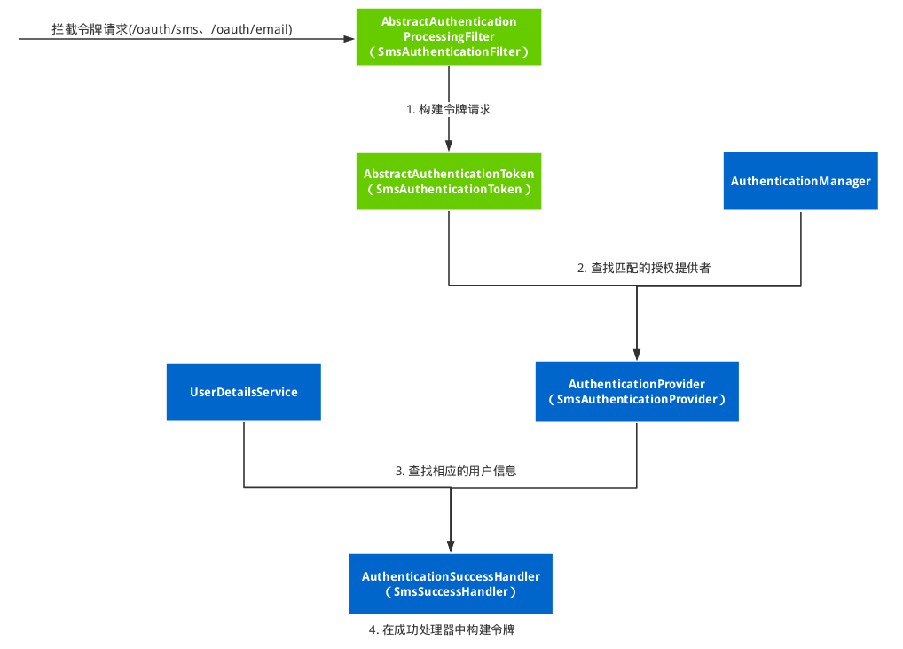

## 自定义端点

### 按照 spring security 的流程添加授权模式

>请注意：这里是按照 spring security 的流程，并不是 spring security oauth2 的流程来实现的，不能弄混淆。

这一种方式要在理清自定义`controller`方式的基础上，扩展`Spring security oauth2`的授权模式；
也就是还需要我们去了解到他是如何决策使用哪一种授权模式的。

在 Spring security 中，实现登录校验与授权的过程核心是使用过滤器，通过过滤器对登录请求进行拦截，当是登录请求时，就做处理。
而我们过滤器需要继承`org.springframework.security.web.authentication.AbstractAuthenticationProcessingFilter`这个类，
它是基于浏览器的 HTTP 身份验证请求的抽象处理器，我们可以参考他的子类`UsernamePasswordAuthenticationFilter`来写我们自己的过滤器。
在那之前，我画一张图，让大家更好的理解整个授权过程：


1. 过滤器拦截请求，验证请求参数，构建相应的令牌对象 SmsAuthenticationToken 。
2. 授权管理器 AuthenticationManager 的子类 ProviderManager 对令牌进行授权。
3. 授权的时候会去查找 AuthenticationProvider 的实现类，我们提供了 SmsAuthenticationProvider 来实现。
4. 通过在 AuthenticationProvider 使用 UserDetailsService 查找用户信息，如果找到就授权成功。
5. 授权成功后，将授权信息交给授权成功处理器 AuthenticationSuccessHandler 进行处理，构建 token。

这个过程相比起来要复杂一点，因为我们需要自己建一些实现类，总结下来如下：
1. 继承 AbstractAuthenticationProcessingFilter 的过滤器
2. 继承 AbstractAuthenticationToken 的令牌请求
3. 实现 AuthenticationProvider 的授权提供者
4. 继承 AbstractAuthenticationToken 的成功处理器
5. 配置过滤器、成功处理器等

我们一步一步的来，先是过滤器：
```java
/**
 * 短信登录授权过滤器
 *
 */
public class SmsAuthenticationFilter extends AbstractAuthenticationProcessingFilter {

    SmsAuthenticationFilter() {
        // 需要拦截的路径
        super(new AntPathRequestMatcher("/oauth/sms", HttpMethod.POST.name()));
    }

    @Override
    public Authentication attemptAuthentication(HttpServletRequest request,
                                                HttpServletResponse response) throws AuthenticationException {
        if (!HttpMethod.POST.matches(request.getMethod())) {
            throw new AuthenticationServiceException(
                    "Authentication method not supported: " + request.getMethod());
        }
        // 获取参数
        String sms = obtainSms(request);
        sms = sms == null ? "" : sms.trim();
        // 我们需要创建我们自己的授权 token
        SmsAuthenticationToken authRequest = new SmsAuthenticationToken(sms);
        setDetails(request, authRequest);
        // 授权管理器对请求进行授权
        return this.getAuthenticationManager().authenticate(authRequest);
    }

    /**
     * 获取请求中的 sms 值
     *
     * @param request 正在为其创建身份验证请求
     * @return 请求中的 sms 值
     */
    private String obtainSms(HttpServletRequest request) {
        return request.getParameter("sms");
    }

    /**
     * 提供以便子类可以配置放入 authentication request 的 details 属性的内容
     *
     * @param request     正在为其创建身份验证请求
     * @param authRequest 应设置其详细信息的身份验证请求对象
     */
    private void setDetails(HttpServletRequest request,
                            SmsAuthenticationToken authRequest) {
        authRequest.setDetails(authenticationDetailsSource.buildDetails(request));
    }

}
```
再是创建我们自己的授权请求 SmsAuthenticationToken:
```java
/**
 * 这里你完全可以使用 {@link UsernamePasswordAuthenticationToken}，他完全满足需求
 * 只是为了简单和统一，我改个名字并且去掉了 凭证 这个字段
 *
 * @author <a href="https://echocow.cn">EchoCow</a>
 * @date 2019/7/29 下午10:53
 */
public class SmsAuthenticationToken extends AbstractAuthenticationToken {

    private static final long serialVersionUID = SpringSecurityCoreVersion.SERIAL_VERSION_UID;

    private final Object principal;

    SmsAuthenticationToken(Object phone) {
        super(null);
        this.principal = phone;
        setAuthenticated(false);
    }

    SmsAuthenticationToken(Object principal, Collection<? extends GrantedAuthority> authorities) {
        super(authorities);
        this.principal = principal;
        super.setAuthenticated(true);
    }

    @Override
    public Object getCredentials() {
        return null;
    }

    @Override
    public Object getPrincipal() {
        return this.principal;
    }

    @Override
    public void setAuthenticated(boolean isAuthenticated) throws IllegalArgumentException {
        if (isAuthenticated) {
            throw new IllegalArgumentException(
                    "Cannot set this token to trusted - use constructor which takes a GrantedAuthority list instead");
        }
        super.setAuthenticated(false);
    }

    @Override
    public void eraseCredentials() {
        super.eraseCredentials();
    }
}
```
接下来就是授权提供者 SmsAuthenticationProvider:
```java
/**
 * 授权提供者
 * 
 */
@Setter
public class SmsAuthenticationProvider implements AuthenticationProvider {

    private UserDetailsService userDetailsService;

    @Override
    public Authentication authenticate(Authentication authentication) throws AuthenticationException {
        SmsAuthenticationToken authenticationToken = (SmsAuthenticationToken) authentication;
        // 获取用户信息
        UserDetails user = userDetailsService.loadUserByUsername(authenticationToken.getPrincipal().toString());
        if (user == null) {
            throw new InternalAuthenticationServiceException("无效认证");
        }
        SmsAuthenticationToken authenticationResult = new SmsAuthenticationToken(user, user.getAuthorities());
        authenticationResult.setDetails(authenticationToken.getDetails());
        return authenticationResult;
    }

    @Override
    public boolean supports(Class<?> authentication) {
        // 通过类型进行匹配
        return SmsAuthenticationToken.class.isAssignableFrom(authentication);
    }
}
```
最后就是授权成功处理器，在这里生成 token，所以直接复制上一种模式的生成方法即可：
```java
/**
 * @author <a href="https://echocow.cn">EchoCow</a>
 * @date 2019/7/29 下午11:03
 */
@Slf4j
@Component
@SuppressWarnings("Duplicates")
@RequiredArgsConstructor
public class SmsSuccessHandler implements AuthenticationSuccessHandler {

    private final @NonNull ClientDetailsService clientDetailsService;
    private final @NonNull PasswordEncoder passwordEncoder;
    private final @NonNull AuthorizationServerTokenServices authorizationServerTokenServices;
    private final @NonNull ObjectMapper objectMapper;

    @Override
    public void onAuthenticationSuccess(HttpServletRequest request, HttpServletResponse response, Authentication authentication) throws IOException {

        log.info("Login succeed！");
        // 1. 获取客户端认证信息
        String header = request.getHeader("Authorization");
        if (header == null || !header.toLowerCase().startsWith("basic ")) {
            throw new UnapprovedClientAuthenticationException("请求头中无客户端信息");
        }

        // 解密请求头
        String[] client = extractAndDecodeHeader(header);
        if (client.length != 2) {
            throw new BadCredentialsException("Invalid basic authentication token");
        }
        String clientId = client[0];
        String clientSecret = client[1];

        // 获取客户端信息进行对比判断
        ClientDetails clientDetails = clientDetailsService.loadClientByClientId(clientId);
        if (clientDetails == null) {
            throw new UnapprovedClientAuthenticationException("客户端信息不存在：" + clientId);
        } else if (!passwordEncoder.matches(clientSecret, clientDetails.getClientSecret())) {
            throw new UnapprovedClientAuthenticationException("客户端密钥不匹配" + clientSecret);
        }
        // 2. 构建令牌请求
        TokenRequest tokenRequest = new TokenRequest(new HashMap<>(0), clientId, clientDetails.getScope(), "custom");
        // 3. 创建 oauth2 令牌请求
        OAuth2Request oAuth2Request = tokenRequest.createOAuth2Request(clientDetails);
        // 4. 获取当前用户信息（省略，前面已经获取过了）
        // 5. 构建用户授权令牌 (省略，已经传过来了)
        // 6. 构建 oauth2 身份验证令牌
        OAuth2Authentication oAuth2Authentication = new OAuth2Authentication(oAuth2Request, authentication);
        // 7. 创建令牌
        OAuth2AccessToken accessToken = authorizationServerTokenServices.createAccessToken(oAuth2Authentication);

        // 直接结束
        response.setContentType("application/json;charset=utf-8");
        response.getWriter().write(objectMapper.writeValueAsString(accessToken));
    }


    /**
     * 对请求头进行解密以及解析
     *
     * @param header 请求头
     * @return 客户端信息
     */
    private String[] extractAndDecodeHeader(String header) {
        byte[] base64Token = header.substring(6).getBytes(StandardCharsets.UTF_8);
        byte[] decoded;
        try {
            decoded = Base64.getDecoder().decode(base64Token);
        } catch (IllegalArgumentException e) {
            throw new BadCredentialsException(
                    "Failed to decode basic authentication token");
        }
        String token = new String(decoded, StandardCharsets.UTF_8);
        int delimiter = token.indexOf(":");

        if (delimiter == -1) {
            throw new BadCredentialsException("Invalid basic authentication token");
        }
        return new String[]{token.substring(0, delimiter), token.substring(delimiter + 1)};
    }
}
```
接下来就是将它配置进去，我们独立出他的配置 SmsAuthenticationSecurityConfig:
```java
/**
 * sms 配置
 *
 */
@Component
public class SmsAuthenticationSecurityConfig
        extends SecurityConfigurerAdapter<DefaultSecurityFilterChain, HttpSecurity> {

    @Autowired
    @SuppressWarnings("all")
    private  UserDetailsService userDetailsService;
    @Autowired
    @SuppressWarnings("all")
    private SmsSuccessHandler smsSuccessHandler;

    @Override
    public void configure(HttpSecurity http)  {
        // 过滤器
        SmsAuthenticationFilter smsAuthenticationFilter = new SmsAuthenticationFilter();
        smsAuthenticationFilter.setAuthenticationManager(http.getSharedObject(AuthenticationManager.class));
        smsAuthenticationFilter.setAuthenticationSuccessHandler(smsSuccessHandler);

        // 授权提供者
        SmsAuthenticationProvider smsAuthenticationProvider = new SmsAuthenticationProvider();
        smsAuthenticationProvider.setUserDetailsService(userDetailsService);

        // 过滤器
        http.authenticationProvider(smsAuthenticationProvider)
                .addFilterAfter(smsAuthenticationFilter, UsernamePasswordAuthenticationFilter.class);
    }
}
```
Q：为什么这里使用字段注入呢？

A：不使用构造器注入最主要的原因在于会造成依赖环，因为我们这里注入了 UserDetailsService ，而在使用的时候， SmsSuccessHandler 里面也同样注入了 UserDetailsService 而后面我们需要在 安全配置 SecurityConfig 中引入 SmsAuthenticationSecurityConfig ， UserDetailsService 是在 SecurityConfig 创建的，这个时候就会有一个依赖环的问题了。是使用的先呢？还是创建的先？Spring 就不知道了，但是构造器注入是 Bean 初始化的时候给的，那个时候不一定有 UserDetailsService ，所以使用字段注入，他会在有的时候自动注入进去。

接下来安全配置 SecurityConfig ：
```
private final @NonNull SmsAuthenticationSecurityConfig smsAuthenticationSecurityConfig;

@Override
protected void configure(HttpSecurity http) throws Exception {
    http
        // 添加进去即可
        .apply(smsAuthenticationSecurityConfig)
        .and()
        .authorizeRequests()
        .antMatchers("/code/*").permitAll()
        .antMatchers("/auth/sms").permitAll()
        .antMatchers("/custom/**").permitAll()
        .anyRequest().authenticated()
        .and()
        .csrf().disable()
        .formLogin()
        .and()
        .httpBasic();


    http
        .addFilterBefore(validateCodeFilter, AbstractPreAuthenticatedProcessingFilter.class);
}
```