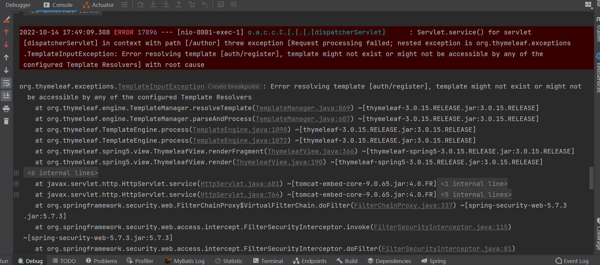
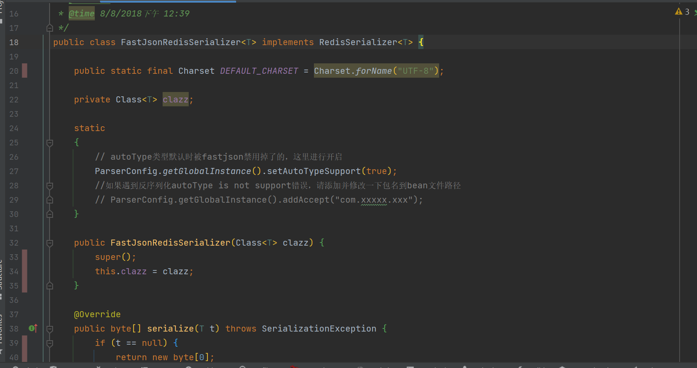
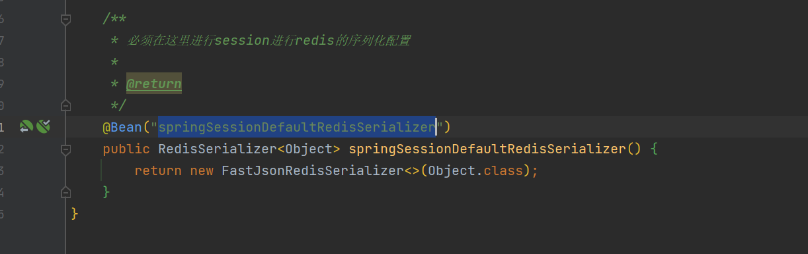

## JdbcClientDetailsService
点进去看源码，定义对象即自动获取数据库表`oauth_client_details`的相关数据
该类实现的两个接口`ClientDetailsService, ClientRegistrationService`
可以重新实现这两个接口进行自定义客户端

## 资源服务器与认证服务器不在同一进程（各自分离属于不同服务）情况下，资源服务器无法使用认证服务器进行权限控制

有问题的配置（这个要调试才知道，我没做）：

```yaml
security:
  oauth2:
    resource:
      filter-order: 3
      id: test_resource_id
      user-info-uri: http://localhost:7006/user/principal
      prefer-token-info: false
```
这个问题引起的原因就是prefer-token-info(当然可以不用‘-’，用大写去掉其后字母），这里如果使用false，表示不使用token进行验证。使用用户信息进行验证，这里原因是因为我们已经获取到了token，所以这里应该使用token进行验证。修改如下：

纠正配置：
```yaml
security:
  oauth2:
    resource:
      filter-order: 3
      id: test_resource_id
      tokenInfoUri: http://localhost:7006/oauth/check_token
      preferTokenInfo: true
```
这样就可以使用token访问资源服务器了，提到如何使用access_token访问资源服务器，这里也遇到一个问题，顺便一块提一下：

（1）如果认证服务器不是资源服务器的情况下（也就是只存在AuthorizationServer和WebSecurity的情况下，没有ResourceServer），此时使用token访问只能通过http头部携带Authentication字段，且值必须为bearer + 空格 + token的方式，如http头包含： authentication： bearer 12323435-4354

（2）如果认证服务器同时也是资源服务器的情况下（也就是即存在AuthorizationServer、WebSecurity也存在ResourceServer），此时可以使用如下两种方式访问资源服务器：

a、http头部携带Authorization，如： Authorization: Bearer 1234    （中间有空格）

b、http头部不存在Authorization，直接将access_token作为url参数，如  url?access_token=1234

还有一个大问题就是如果授权服务也是资源服务，势必导致WebSecurity与ResourceServer冲突问题，这里必须必须记住的是WebSecurity的bean的order要高于ResourceServer。也就是如下配置，WebSecurity配置：
```java
package com.donwait.config;

import org.springframework.beans.factory.annotation.Autowired;
import org.springframework.context.annotation.Bean;
import org.springframework.context.annotation.Configuration;
import org.springframework.core.annotation.Order;
import org.springframework.security.authentication.AuthenticationManager;
import org.springframework.security.config.annotation.authentication.builders.AuthenticationManagerBuilder;
import org.springframework.security.config.annotation.web.builders.HttpSecurity;
import org.springframework.security.config.annotation.web.builders.WebSecurity;
import org.springframework.security.config.annotation.web.configuration.WebSecurityConfigurerAdapter;
import org.springframework.security.crypto.bcrypt.BCryptPasswordEncoder;
import org.springframework.security.crypto.password.PasswordEncoder;
import com.donwait.service.impl.UserDetailsServiceImpl;

@Configuration
@Order(2)
public class WebSecurityConfig extends WebSecurityConfigurerAdapter {

    @Autowired
    private UserDetailsServiceImpl userDetailsService;
    
    @Bean
    public PasswordEncoder passwordEncoder() {
        return new BCryptPasswordEncoder();
    }

 

    @Override
    @Bean
    public AuthenticationManager authenticationManagerBean() throws Exception {
        return super.authenticationManagerBean();
    }

    @Override
    protected void configure(AuthenticationManagerBuilder auth) throws Exception {
        auth.userDetailsService(userDetailsService)
            .passwordEncoder(passwordEncoder());
    }
    
    @Override
    public void configure(WebSecurity web) throws Exception {
        web.ignoring().antMatchers("/favor.ico", "/favicon.ico");
    }

 

    @Override
    protected void configure(HttpSecurity http) throws Exception {

        http
            .authorizeRequests()
                .anyRequest().authenticated()
            .and()
                .formLogin().and()
                .csrf().disable()
                .httpBasic();
    }

}
```
资源服务器配置：
```java
package com.donwait.config;

import org.springframework.context.annotation.Configuration;
import org.springframework.core.annotation.Order;
import org.springframework.security.config.annotation.web.builders.HttpSecurity;
import org.springframework.security.oauth2.config.annotation.web.configuration.EnableResourceServer;
import org.springframework.security.oauth2.config.annotation.web.configuration.ResourceServerConfigurerAdapter;
import org.springframework.security.oauth2.config.annotation.web.configurers.ResourceServerSecurityConfigurer;


@Configuration
@EnableResourceServer
@Order(6)
public class ResourceServerConfig extends ResourceServerConfigurerAdapter {

    private static final String DEMO_RESOURCE_ID = "oauth2-resource";

    /**
     * 以代码形式配置资源服务器id，配置文件配置不生效
     */
    @Override
    public void configure(ResourceServerSecurityConfigurer resources) {
        resources.resourceId(DEMO_RESOURCE_ID).stateless(true);
    }
    
    @Override
    public void configure(HttpSecurity http) throws Exception {
        http.
            csrf().disable()
            .authorizeRequests()
                .anyRequest().authenticated()
            .and()
            .httpBasic();
    }

}
```

## failureHandler

当用户使用oauth2的接口时，不会触发security的相关机制。只有当用户使用自定义接口或security的接口时。

## failureForwardUrl

用户登录失败时前往的页面，但不能回到loginPage，否则无法获取modelAndView中添加的数据。

>备注：使用自定义接口时，若是要返回json数据，别忘了加上`@ResponseBody`注解，否则会报如下错误：
> 
> 

## spring-session集成注意点
1. spring-session内部集成了redis相关配置
2. 因为是通过SessionRepository对spring-session的redis进行序列化的，而RedisOperationsSessionRepository支持的RedisTemplate类型是RedisTemplate<Object, Object>。所以原先集成的redis的模板配置需要改成RedisTemplate<Object, Object>类型.
3. 不能使用Jackson2JsonRedisSerializer进行序列化，会导致spring-session的反序列化失败。我这里采用fastJson进行了自定义的序列化。
4. 使用fastJson进行自定义序列化，UserDetails的实现类会无法序列化，报`autoType is not support.`的错误，需进行相关配置,[参考链接](https://github.com/alibaba/fastjson/wiki/fastjson_safemode),本项目配置如下：


>备注一：给一个若依的相关配置：https://codeantenna.com/a/GNPkUr1y3j

>备注二： 第二步也可以直接实例化`springSessionDefaultRedisSerializer`，这样RedisTemplate的类型依然可以是`RedisTemplate<String, Object>`。
> 同时，必须指定Bean的名字为`springSessionDefaultRedisSerializer`。
> 

> 备注三：fastJson版本得用1.2.37或者1.2.49