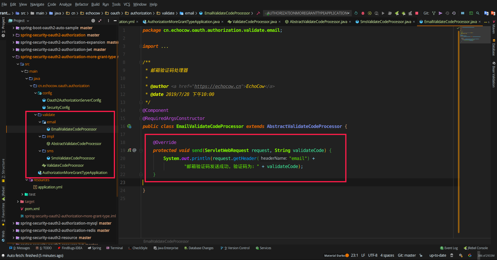

## 集成腾讯短信验证码服务

## 验证码

手机和邮箱登录的过程无非就是需要用户填入手机号或者邮箱号，然后我们下发一条短信或者一封邮件，内容就是验证码，然后授权授权服务器验证用户输入的验证码是否是我们发送的即可。我们用一张图来诠释前后端分离的情况下验证码的流程


1. 用户请求得到登录页面，前端负责
2. 用户填写手机号完毕
   1. 点击前端获取验证码按钮
   2. 向资源服务器发出验证码获取请求
   3. 资源服务器在内网携带客户端信息向授权服务器请求验证码
   4. 授权服务器生成验证码然后存入 Redis 或者内存中
   5. 返回生成结果(可省，一般来说，我们需要向一个运营商申请短信接口，在发短信验证码时如果等待发送结果会造成用户等待时间过长，所以一般不进行等待，如果获取失败，就让用户再获取一次即可)
3. 用户获取验证码，完成表单填写
   1. 资源服务器携带客户端信息向授权服务器请求验证 
   2. 返回结果

这个过程比较复杂的就是需要授权服务器作为一个中间人，为什么要这样呢？在上一篇文章中其实就提过，就是为了保护我们应用的 客户端信息（即加密后的客户端 id 和客户端密钥）。资源服务器是在我们服务器上的，所以由资源服务器发起请求是不会暴露的，但是如果在前端发起就会暴露在用户面前了。

这个过程在授权服务器中需要完成什么呢？
1. 获取验证码
2. 验证验证码

我们来看看第一步的流程图


这一步很简单，就是一个 Controller 就可以完成。但是我们可以发现，出来类型不同，他们其他的房的操作都是相同的，包括生成验证码，存入验证码。那么其实不同的就是如何生成的问题了，这就可以将它抽象出来了。

我们来看看第二步的流程图


这一步相对来说多一些流程，我们需要判断一下当前登录的请求是否是需要验证验证码的，然后选择和事验证码处理器金喜处理与验证，当我们验证通过了以后，才将它放行出去，如果不通过直接打回去就可以了。

前面说到，验证码需要两个步骤才能够完成：
1. 获取验证码
2. 验证验证码

我们一步一步的来，不过在那之前我们需要创建一个新的模块来完成任务。我们的扩展主要是要在授权服务器上完成的，所以我们就需要创建一个授权服务器。

### 获取验证码

我们再来回顾一下流程图：


按照流程图我们需要如下几步：
1. 提供验证码处理器
2. 获取验证码类型

我们一步一步的完成

#### 提供验证码处理器

我们需要提供相应的验证码处理器来对验证码进行处理，我们前面提到流程的时候说过，**整个验证码的过程除了会因为验证码类型不同会选用不同的处理器去完成，其余的操作都一样的。**

所以我们可以考虑使用设计模式来增加我们系统的扩展性。需要考虑如下的点：
1. 面向接口编程
2. 开放封闭原则
3. 提供相同行为的不同实现
4. 提取公共部分代码，子类扩展不同部分

前面三点很好的符合了 **策略设计模式** 的特点，而第四点则是比较适合 模板方法模式，那么我们就将他们结合来用，来完成我们的验证码处理器。两种设计模式的具体作用请自行查找。

我们先准备一个接口，即 **抽象策略**，各种不同的验证码类型以不同的方式实现这个接口，环境角色使用这个接口调用不同的算法，用来进行验证码处理：
```java
public interface ValidateCodeProcessor {

    /**
     * 创建验证码
     *
     * @param request 请求
     * @throws Exception 异常
     */
    void create(ServletWebRequest request) throws Exception;

    /**
     * 验证验证码
     *
     * @param request 请求
     */
    void validate(ServletWebRequest request);

}
```
然后我们定义一个抽象的 **模板方法** 来实现这个抽象策略，**对于公共部分，就是我们的生成和保存操作，最后的发送操作是需要我们自己去自定义的，** 所以我们交由子类来实现：
```java
/**
 * 模板方法实现抽象策略
 *
 * @author <a href="https://echocow.cn">EchoCow</a>
 * @date 2019/7/28 下午9:48
 */
public abstract class AbstractValidateCodeProcessor implements ValidateCodeProcessor {
    @Override
    public void create(ServletWebRequest request) throws Exception {
        String validateCode = generate(request);
        save(request, validateCode);
        send(request, validateCode);
    }

    @Override
    public void validate(ServletWebRequest request) {

    }

    /**
     * 发送验证码，由子类实现
     *
     * @param request      请求
     * @param validateCode 验证码
     */
    protected abstract void send(ServletWebRequest request, String validateCode);

    /**
     * 保存验证码，保存到 redis 中
     *
     * @param request      请求
     * @param validateCode 验证码
     */
    private void save(ServletWebRequest request, String validateCode) {

    }

    /**
     * 生成验证码
     *
     * @param request 请求
     * @return 验证码
     */
    private String generate(ServletWebRequest request) {
        return null;
    }

}
```
对于不同的实现，比如手机验证码，就来继承这个抽象的策略就行了，也就是 具体策略，如下：
```java
@Component
@RequiredArgsConstructor
public class SmsValidateCodeProcessor extends AbstractValidateCodeProcessor {

    @Override
    protected void send(ServletWebRequest request, String validateCode) {
        System.out.println(request.getHeader("sms") +
                "手机验证码发送成功，验证码为：" + validateCode);
    }

}
```
对于邮箱验证码呢？同样的，继承这个抽象策略就好了，他就是另外一种 具体策略，如下
```java
@Component
@RequiredArgsConstructor
public class EmailValidateCodeProcessor extends AbstractValidateCodeProcessor {

    @Override
    protected void send(ServletWebRequest request, String validateCode) {
        System.out.println(request.getHeader("email") +
                "邮箱验证码发送成功，验证码为：" + validateCode);
    }

}
```
具体策略我就做了打印，因为我并没有引入相应的 API 和依赖

现在的代码如下：


接下来我们需要做的事情就是完善抽象策略中的公共方法，包括：
1. 生成验证码
2. 保存验证码
3. 验证验证码（后面再说）

### 生成验证码

遵循面向对象的单一职责原则，对象不应该承担太多职责，我们为了解除耦合，独立出他的接口来，创建一个接口如下：
```java
/**
 * 验证码生成
 *
 * @author <a href="https://echocow.cn">EchoCow</a>
 * @date 2019/7/28 下午10:17
 */
public interface ValidateCodeGenerator {
    /**
     * 生成验证码
     *
     * @param request 请求
     * @return 生成结果
     */
    String generate(ServletWebRequest request);

}
```
然后对于不同的验证码使用不同的生成策略，先引入一个以前写的随机字符串生成器如下：
```java
/**
 * 随机生成 验证码
 *
 * @author echo
 * @version 1.0
 * @date 19-5-20 15:45
 */
public class RandomCode {
    private static final char[] MORE_CHAR = "0123456789abcdefghijklmnopqrstuvwxyzABCDEFGHIJKLMNOPQRSTUVWXYZ".toCharArray();
    private static final Random RANDOM = new Random();

    /**
     * 随机生成验证码
     *
     * @param length 长度
     * @param end    结束长度
     * @return 结果
     */
    private static String random(Integer length, Integer end) {
        StringBuilder result = new StringBuilder();
        for (int i = 0; i < length; i++) {
            result.append(MORE_CHAR[RANDOM.nextInt(end)]);
        }
        return result.toString();
    }

    /**
     * 随机生成验证码
     *
     * @param length  长度
     * @param onlyNum 是否只要数字
     * @return 结果
     */
    public static String random(Integer length, Boolean onlyNum) {
        return onlyNum ? random(length, 10) : random(length, MORE_CHAR.length);
    }

    /**
     * 随机生成验证码
     *
     * @param length 长度
     * @return 结果
     */
    public static String random(Integer length) {
        return random(length, false);
    }
}
```
创建 ValidateCodeGenerator 的手机、邮箱实现类如下
```java
/**
 * 手机验证码生成器
 *
 * @author <a href="https://echocow.cn">EchoCow</a>
 * @date 2019/7/28 下午10:23
 */
@Component
public class SmsValidateCodeGenerator implements ValidateCodeGenerator {

    @Override
    public String generate(ServletWebRequest request) {
        // 定义手机验证码生成策略，可以使用 request 中从请求动态获取生成策略
        // 可以从配置文件中读取生成策略
        return RandomCode.random(4, true);
    }

}
```
```java
/**
 * 邮箱验证码生成器
 *
 * @author <a href="https://echocow.cn">EchoCow</a>
 * @date 2019/7/28 下午10:23
 */
@Component
public class EmailValidateCodeGenerator implements ValidateCodeGenerator {

    @Override
    public String generate(ServletWebRequest request) {
        return RandomCode.random(6);
    }

}
```
修改抽象策略中的生成方法如下：（代码很简单就不赘述了）
```markdown
    /**
     * 收集系统中所有的 {@link ValidateCodeGenerator} 接口实现。
     */
    @Autowired
    private Map<String, ValidateCodeGenerator> validateCodeGenerators;


    /**
     * 生成验证码
     *
     * @param request 请求
     * @return 验证码
     */
    private String generate(ServletWebRequest request) {
        String type = getValidateCodeType(request);
        String componentName = type + ValidateCodeGenerator.class.getSimpleName();
        ValidateCodeGenerator generator = validateCodeGenerators.get(componentName);
        if (Objects.isNull(generator)) {
            throw new ValidateCodeException("验证码生成器 " + componentName + " 不存在。");
        }
        return generator.generate(request);
    }

    /**
     * 根据请求 url 获取验证码类型
     *
     * @return 结果
     */
    private String getValidateCodeType(String uri) {
        String uri = request.getRequest().getRequestURI();
        int index = uri.lastIndexOf("/") + 1;
        return uri.substring(index).toLowerCase();
    }
```
当然，我自定义了一个异常，专门处理验证码的：
```java
/**
 * @author <a href="https://echocow.cn">EchoCow</a>
 * @date 2019/7/28 下午10:34
 */
public class ValidateCodeException extends RuntimeException {
    public ValidationException(String message) {
        super(message);
    }
}
```

### 保存验证码

这里就无非是操作 Redis 了，写一个 repository 就可以了：
```java
/**
 * 验证码资源处理
 *
 * @author echo
 * @date 2019/7/28 下午10:44
 */
public interface ValidateCodeRepository {

    /**
     * 保存
     *
     * @param request 请求
     * @param code    验证码
     * @param type    类型
     */
    void save(ServletWebRequest request, String code, String type);

    /**
     * 获取
     *
     * @param request 请求
     * @param type    类型
     * @return 验证码
     */
    String get(ServletWebRequest request, String type);

    /**
     * 移除
     *
     * @param request 请求
     * @param type    类型
     */
    void remove(ServletWebRequest request, String type);


}
```
然后一个实现类，代码很简单，就不赘述了。
```java
/**
 * redis 验证码操作
 *
 * @author <a href="https://echocow.cn">EchoCow</a>
 * @date 2019/7/28 下午10:44
 */
@Component
@RequiredArgsConstructor
public class ValidateCodeRepositoryImpl implements ValidateCodeRepository {

    private final @NonNull RedisTemplate<String, String> redisTemplate;

    @Override
    public void save(ServletWebRequest request, String code, String type) {
        redisTemplate.opsForValue().set(buildKey(request, type), code,
                //  有效期可以从配置文件中读取或者请求中读取
                Duration.ofMinutes(10).getSeconds(), TimeUnit.SECONDS);
    }

    @Override
    public String get(ServletWebRequest request, String type) {
        return redisTemplate.opsForValue().get(buildKey(request, type));
    }

    @Override
    public void remove(ServletWebRequest request, String type) {
        redisTemplate.delete(buildKey(request, type));
    }

    private String buildKey(ServletWebRequest request, String type) {
        String deviceId = request.getHeader(type);
        if (StringUtils.isEmpty(deviceId)) {
            throw new ValidateCodeException("请求中不存在邮箱号");
        }
        return "code:" + type + ":" +  deviceId;
    }
}
```
然后注入到抽象策略中直接使用就好了：
```markdown
@Autowired
private ValidateCodeRepository validateCodeRepository;

/**
 * 保存验证码，保存到 redis 中
 *
 * @param request      请求
 * @param validateCode 验证码
 */
private void save(ServletWebRequest request, String validateCode) {
    validateCodeRepository.save(request,validateCode,getValidateCodeType(request));
}
```
这样我们的验证码处理器就算完成一部分了，关于对验证码进行验证我们后面再说，现在我们的目录结构应该是这样的：


### 获取验证码类型

这一步非常简单，提供一个 控制器 即可，我们先编写一个空的控制器如下：
```java
/**
 * 动态获取验证码
 *
 * @author <a href="https://echocow.cn">EchoCow</a>
 * @date 2019/7/28 下午10:57
 */
@RestController
@RequiredArgsConstructor
public class ValidateCodeController {

    /**
     * 通过 type 进行查询到对应的处理器
     * 同时创建验证码
     *
     * @param request  请求
     * @param response 响应
     * @param type     验证码类型
     * @throws Exception 异常
     */
    @GetMapping("/code/{type}")
    public void creatCode(HttpServletRequest request, HttpServletResponse response,
                          @PathVariable String type) throws Exception {
        //
    }

}
```
但是我们怎么指导是哪个来具体策略来处理呢？这里其实就是策略模式中的 **环境类**，在这里决定使用哪一个具体的策略，我们创建一个 **策略分发器** 来完成这件事，如下：
```java
/**
 * 验证码处理分发
 *
 * 通过传递过来的类型，从已经依赖注入容器中搜寻符合名称的组件。
 * 直接通过名称获取对应的 {@link ValidateCodeProcessor} 实现类
 *
 * @author <a href="https://echocow.cn">EchoCow</a>
 * @date 2019/7/28 下午10:59
 */
@Component
@RequiredArgsConstructor
public class ValidateCodeProcessorHolder {

    private final @NonNull Map<String, ValidateCodeProcessor> validateCodeProcessors;

    /**
     * 通过验证码类型查找
     *
     * @param type 验证码类型
     * @return 验证码处理器
     */
    ValidateCodeProcessor findValidateCodeProcessor(String type) {
        String name = type.toLowerCase() + ValidateCodeProcessor.class.getSimpleName();
        ValidateCodeProcessor processor = validateCodeProcessors.get(name);
        if (Objects.isNull(processor)){
            throw new ValidateCodeException("验证码处理器" + name + "不存在");
        }
        return processor;
    }

}
```
然后我们在控制器那里调用一下就可以了：
```markdown
private final @NonNull ValidateCodeProcessorHolder validateCodeProcessorHolder;

/**
 * 通过 type 进行查询到对应的处理器
 * 同时创建验证码
 *
 * @param request  请求
 * @param response 响应
 * @param type     验证码类型
 * @throws Exception 异常
 */
@GetMapping("/code/{type}")
public void createCode(HttpServletRequest request, HttpServletResponse response,
                          @PathVariable String type) throws Exception {
    validateCodeProcessorHolder.findValidateCodeProcessor(type)
        .create(new ServletWebRequest(request, response));
}
```
我们测试一下访问：


然后查看控制台


再去看看 Redis


可以看到验证码已经保存进去并且生成了的。

### 验证验证码

接下来我们需要做的就是验证验证码的过程了，再来回顾一遍流程图


所以我们需要通过过滤器来实现，如果是手机或邮箱登录请求，我们就需要检验是否有验证码；如果不是，就放行。

所以第一步我们就需要创建这么一个过滤器：
```java
/**
 * 验证码过滤器。
 *
 * <p>继承于 {@link OncePerRequestFilter} 确保在一次请求只通过一次filter</p>
 * <p>需要配置指定拦截路径，默认拦截 POST 请求</p>
 *
 * @author <a href="https://echocow.cn">EchoCow</a>
 * @date 2019/7/28 下午11:15
 */
@Slf4j
@Component
@RequiredArgsConstructor
public class ValidateCodeFilter extends OncePerRequestFilter {

    private final @NonNull ValidateCodeProcessorHolder validateCodeProcessorHolder;
    private Map<String, String> urlMap = new HashMap<>();
    private AntPathMatcher antPathMatcher = new AntPathMatcher();

    @Override
    public void afterPropertiesSet() throws ServletException {
        super.afterPropertiesSet();
        // 路径拦截
        urlMap.put("/oauth/sms", "sms");
        urlMap.put("/oauth/email", "email");
    }

    @Override
    protected void doFilterInternal(HttpServletRequest request, HttpServletResponse response, FilterChain filterChain) throws ServletException, IOException {
        String validateCodeType = getValidateCodeType(request);
        if (!StringUtils.isEmpty(validateCodeType)) {
            try {
                log.info("请求需要验证！验证请求：" + request.getRequestURI() + " 验证类型：" + validateCodeType);
                validateCodeProcessorHolder.findValidateCodeProcessor(validateCodeType)
                        .validate(new ServletWebRequest(request, response));
            } catch (Exception e) {
                e.printStackTrace();
                return;
            }
        }
        filterChain.doFilter(request, response);
    }

    private String getValidateCodeType(HttpServletRequest request) {
        if (HttpMethod.POST.matches(request.getMethod())) {
            Set<String> urls = urlMap.keySet();
            for (String url : urls) {
                // 如果路径匹配，就回去他的类型，也就是 map 的 value
                if (antPathMatcher.match(url, request.getRequestURI())) {
                    return urlMap.get(url);
                }
            }
        }
        return null;
    }
}
```
接下来我们就要去完成 验证 的具体逻辑了，回到我们的 抽象策略 中来：
```markdown
@Override
public void validate(ServletWebRequest request) {
    String type = getValidateCodeType(request);
    String code = validateCodeRepository.get(request, type);
    // 验证码是否存在
    if (Objects.isNull(code)) {
        throw new ValidateCodeException("获取验证码失败，请检查输入是否正确或重新发送！");
    }
    // 验证码输入是否正确
    if (!code.equalsIgnoreCase(request.getParameter("code"))) {
        throw new ValidateCodeException("验证码不正确，请重新输入！");
    }
    // 验证通过后，清除验证码
    validateCodeRepository.remove(request, type);
}
```
非常简单的验证逻辑，最后我们创建一个控制器来测试：
@RestController
@RequestMapping("/oauth")
public class Oauth2Controller {

    @PostMapping("/sms")
    public HttpEntity<?> sms() {
        return ResponseEntity.ok("ok");
    }
}
接下来就是把我们写好的过滤器添加到 Spring security 中的过滤链里去：
```markdown
private final @NonNull ValidateCodeFilter validateCodeFilter;

@Override
protected void configure(HttpSecurity http) throws Exception {
    http
        .authorizeRequests()
        // 添加路径
        .antMatchers("/oauth/sms").access("permitAll()")
        .antMatchers("/oauth/email").access("permitAll()")
        .antMatchers("/code/*").permitAll()
        .anyRequest()
        .authenticated()
        // 务必关闭 csrf，否则除了 get 请求，都会报 403 错误
        .and()
        .csrf().disable();

    // 添加过滤器
    http
        .addFilterBefore(validateCodeFilter, AbstractPreAuthenticatedProcessingFilter.class);
}
```
然后我们来测试一下，先是启动后，请求验证码：


去控制台看看验证码多少


然后携带者设备号和验证码去请求一下测试接口 /oauth/sms


验证码


成功


看看控制台：


接下来我们再请求一次看看：


可以看到控制台报错了


我们对于异常处理可以创建一个授权失败的异常处理器，然后将它用来接收所有的授权失败的异常。这个我们后面再来说。现在的代码结构如下：


### 小修改

接下来我们要修改前面的一个地方，前面我们的手机号和邮箱号是从请求头中获取的，我们应该从请求体中获取，修改 ValidateCodeRepositoryImpl 类
```markdown
    private String buildKey(ServletWebRequest request, String type) {
        String deviceId = request.getParameter(type);
        if (StringUtils.isEmpty(deviceId)) {
            throw new ValidateCodeException("请求中不存在 " + type);
        }
        return "code:" + type + ":" + deviceId;
    }
```
再修改具体的策略如下：
```java
@Component
public class EmailValidateCodeProcessor extends AbstractValidateCodeProcessor {

    @Override
    protected void send(ServletWebRequest request, String validateCode) {
        System.out.println(request.getParameter("email") +
                "邮箱验证码发送成功，验证码为：" + validateCode);
    }

}
```
```java
@Component
public class SmsValidateCodeProcessor extends AbstractValidateCodeProcessor {

    @Override
    protected void send(ServletWebRequest request, String validateCode) {
        System.out.println(request.getParameter("sms") +
                "手机验证码发送成功，验证码为：" + validateCode);
    }

}
```
这样我们就修改完毕了。另外我们修改一下现在的测试 controller ，以防止后面的冲突了。修改 Oauth2Controller 为 SmsValidateCodeController ，如下：
```java
@RestController
@RequestMapping("/auth")
public class SmsValidateCodeController {

    @PostMapping("/sms")
    public HttpEntity<?> sms() {
        return ResponseEntity.ok("ok");
    }
}
```
修改安全配置 SecurityConfig
```markdown
    @Override
    protected void configure(HttpSecurity http) throws Exception {
        http
                .authorizeRequests()
                .antMatchers("/code/*").access("permitAll()")
                .antMatchers("/auth/sms").access("permitAll()")
                .anyRequest().authenticated()
                .and()
                .csrf().disable();


        http
                .addFilterBefore(validateCodeFilter, AbstractPreAuthenticatedProcessingFilter.class);
    }
```
然后 ValidateCodeFilter 过滤器中的路径拦截也修改一下：
```markdown
    @Override
    public void afterPropertiesSet() throws ServletException {
        super.afterPropertiesSet();
        // 路径拦截
        urlMap.put("/auth/sms", "sms");
    }
```
修改完毕后务必再测试一次！现在的目录结构如下：


### 回顾

现在我们的验证码也算完成了，回顾一下，我们的类图是这样的


我们整理下如下图：


这个过程就好理解了：
* ValidateCodeController ：决策器，用来决定使用哪一个抽象策略的，同时接收用户请求。
* ValidateCodeProcessor ：抽象策略接口
* AbstractValidateCodeProcessor ：抽象策略实现类，定义了模板方法和抽象策略
* ValidateCodeGenerator ：抽象策略接口，不同的实现类是不同的具体策略

其余的都是具体的实现类了。这样我们的一个可扩展的验证码就完成了，当我们需要扩展新的验证码时就简单多了，直接实现新的 AbstractValidateCodeProcessor 子类和 ValidateCodeGenerator 接口就可以了。后面我们会做一些改变，具体后面再说。

现在我们已经有的验证码端点如下：

| 类型 | 请求 url | 请求参数-请求体 |
| :----: | :----: | :----: |
| 获取手机验证码 | /code/sms | sms |
| 获取邮箱验证码 | /code/email | email |